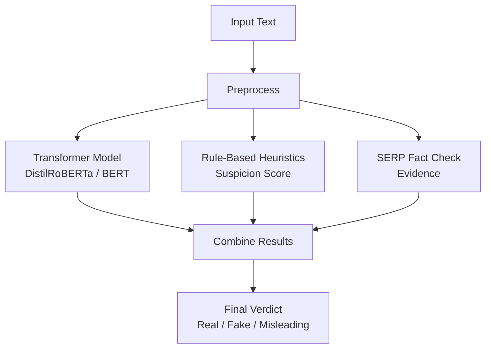

# Hoax Detection System

This project is a **hybrid Fake News / Hoax Detection System** combining **AI (Transformers)**, **NLP**, a **rule-based expert system**, and **SERP API fact verification**.  
It provides **reliable real-time classification** of text into **real**, **fake**, or **misleading**.

---

## Features

### AI-Based Classification  
Uses a fine-tuned **DistilRoBERTa/BERT** model to classify news text accurately.

### SERP Fact Verification  
Automatically queries **SERP API** to verify factual claims and returns concise, evidence-based answers.

### Rule-Based Expert System  
Analyzes content using heuristic rules (keyword patterns, exaggeration, propaganda cues, emotional tone, formatting anomalies) and produces a **Suspicion Score**.

### Batch Processing  
Supports **.txt**, **.csv**, and **.xlsx** input files and generates combined results containing:

- Model prediction  
- Rule-based analysis  
- SERP verification

### Secure API Handling  
Uses **Google Colab Secrets** to safely store and load the SERP API key.

---

## Project Structure

```
HoaxDetectionSystem/
├── HoaxDetectionSystem.ipynb
├── README.md
├── sample_data/
    ├── True.csv
    └── Fake.csv

```

---

## Pipeline



---

## Requirements

Install all dependencies:

```bash
pip install transformers datasets evaluate pandas google-generativeai openpyxl
```
